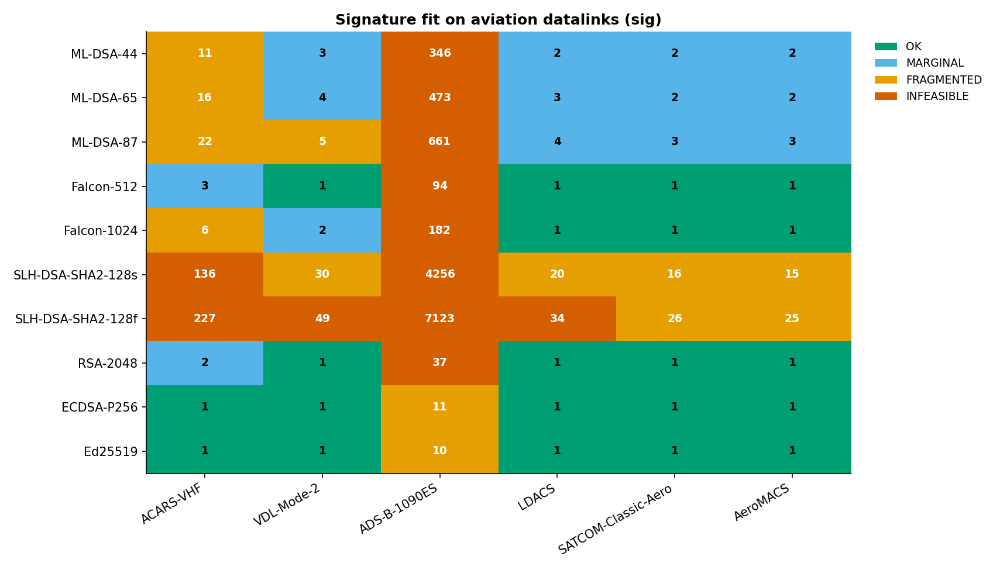

# pqc-aero-bench

[](https://github.com/Thirukumaran-Senthilkumaran/pqc-aero-bench/actions/workflows/ci.yml)
[](https://www.python.org/)
[](LICENSE)

**Post-quantum cryptography, measured against the hard physical limits of civil-aviation datalinks.**

A reproducible benchmark suite that scores every NIST-standardised post-quantum primitive
([FIPS 203 / ML-KEM](https://csrc.nist.gov/pubs/fips/203/final), [FIPS 204 / ML-DSA](https://csrc.nist.gov/pubs/fips/204/final),
[FIPS 205 / SLH-DSA](https://csrc.nist.gov/pubs/fips/205/final), and the upcoming FN-DSA / Falcon)
plus three classical baselines (RSA-2048, ECDSA-P256, Ed25519) against the actual frame sizes,
bitrates and latencies of the datalinks used in flight today and tomorrow:

| Datalink | Standard | Max payload | Net rate | One-way latency | Role |
|---|---|---:|---:|---:|---|
| ACARS-VHF | ARINC 618 / 620 | 220 B | 2.4 kbps | 1500 ms | Legacy ATC / airline ops |
| VDL Mode 2 | ARINC 631 / ICAO Doc 9776 | 1023 B | 31.5 kbps | 800 ms | Primary VHF CPDLC |
| ADS-B 1090ES | RTCA DO-260C | 7 B | 1 Mbps (broadcast) | 50 ms | Surveillance broadcast |
| LDACS | EUROCAE ED-228 | 1500 B | 500 kbps | 100 ms | Future L-band ATM |
| SATCOM Classic Aero | ARINC 781 | 1960 B | 10.5 kbps | 270 ms | Oceanic / remote |
| AeroMACS | RTCA DO-345 | 2048 B | 9 Mbps | 20 ms | Airport surface |

The tool produces three artefacts every run: a machine-readable `report.json`,
a human-readable `report.md`, and a set of publication-quality PNG plots —
including the headline **fit matrix** that turns an otherwise abstract crypto
discussion into a concrete deployment verdict.



> _Cells show the number of max-size frames required to carry one signature.
> Green = fits in a single frame; red = infeasible (>32 fragments).
> See [`results/report.md`](results/report.md) for the full report._

---

## Why this exists

Civil aviation is on the clock. ICAO's ATN/IPS migration, the EU's CP1 mandate
and the [NSA CNSA 2.0 timeline](https://media.defense.gov/2022/Sep/07/2003071834/-1/-1/0/CSA_CNSA_2.0_ALGORITHMS_.PDF)
all push public-key cryptography towards post-quantum primitives by 2030–2035.
But avionics datalinks were not designed for kilobyte-class objects. Three
asymmetries are routinely glossed over in the literature:

1. **Frame ceilings**: an ADS-B Extended Squitter carries 56 bits of payload.
   A Falcon-512 signature — the *smallest* post-quantum signature — needs 94
   such squitters. Ed25519 needs 10.
2. **Bitrate**: ACARS at 2.4 kbps takes ~7 seconds to transmit a single
   ML-DSA-65 signature, before counting per-fragment scheduling overhead.
3. **Latency**: every fragment on a half-duplex link pays a fresh one-way
   latency. On ACARS that is 1.5 s _per fragment_.

`pqc-aero-bench` measures all three at once, then renders the verdict matrix
that a research proposal, certification dossier or PhD literature review
actually needs.

---

## Headline findings (from `results/report.md`)

These come from a real run of this code on Windows 11 / Python 3.12 / `quantcrypt 1.0.1`:

- **ADS-B is a hard wall.** No signature scheme — classical or post-quantum —
  fits in a single Extended Squitter. The cheapest is Ed25519 at 64 B,
  requiring **10** squitters; SLH-DSA-128f needs **7 123**. This rules out
  per-message authentication of ADS-B without redesigning the L1 framing.
- **ACARS cannot host an ephemeral PQC handshake.** Even ML-KEM-512
  (`pk = 800 B`, `ct = 768 B`) needs **4 ACARS fragments per direction** —
  >12 s of airtime for one key exchange. Static, pre-shared PQ keys are the
  only credible path on ACARS.
- **LDACS is the sweet spot.** Falcon-512 fits in **one** 1500 B LDACS frame
  (658 B signature). ML-DSA-65 fits in 3 frames. This identifies LDACS as
  the only existing civil-aviation link that can carry per-message lattice
  PQC signatures with no protocol surgery.
- **Falcon dominates lattice on size at the cost of keygen.** Falcon-512
  beats ML-DSA-44 by ~3.7× on signature bytes (658 B vs 2 420 B), at the
  cost of ~10× slower key generation (`5.5 ms` vs `0.55 ms`). For aviation,
  where keys are rotated infrequently and bytes-on-the-wire dominate the
  link budget, Falcon is the natural lattice choice.
- **SLH-DSA is signature-rich.** SLH-DSA-128s at 29 792 B per signature is
  **136 ACARS fragments**. Useful as a long-term hedge for certificate-level
  signatures (rare, large) — not for per-message authentication on a
  narrowband link.

---

## Quick start

> Requires Python ≥ 3.10. Tested on Windows 11, macOS 14, Ubuntu 22.04 in CI.

```bash
git clone https://github.com/Thirukumaran-Senthilkumaran/pqc-aero-bench.git
cd pqc-aero-bench
python -m pip install -r requirements-dev.txt
pytest                              # 19 tests, < 1 s
python -m pqc_aero_bench list       # show known datalinks and algorithms
python -m pqc_aero_bench run        # full benchmark + report + plots
```

The full run takes ~30 s on a modern laptop (`SLH-DSA-SHA2-128s` signing
dominates at ~315 ms / op; everything else is sub-millisecond).
Add `--quick` for a ~5 s sanity sweep with 6 iterations per measurement.

Outputs land in `results/`:

```
results/
├── report.json                 machine-readable, every measurement
├── report.md                   the human-readable report
└── plots/
    ├── kem_sizes.png
    ├── kem_fit_matrix.png
    ├── signature_sizes.png
    ├── signature_speed.png
    ├── signature_airtime.png
    └── signature_fit_matrix.png
```

---

## What it actually measures

For every algorithm, on every datalink, every run:

| Quantity | Source | Comment |
|---|---|---|
| Public-key size | `len(pk)` on a real keypair | Never read from a hard-coded table |
| Ciphertext / signature size | `len(ct)` or `len(sig)` on a real op | Same |
| Median operation latency | `time.perf_counter_ns()`, 30+ iters | Reports **median + MAD**, not mean |
| Fragments required | `ceil(wire / max_payload)` | Per datalink |
| Wall-clock airtime | `wire/bitrate + N × latency` | Per fragment latency penalty |
| Verdict | OK / MARGINAL / FRAGMENTED / INFEASIBLE | Function of fragment count |

Median + median-absolute-deviation are used everywhere because PQC signing
(notably ML-DSA and Falcon) is heavy-tailed: rejection sampling and FFT
batches produce occasional 5–10× outliers that wreck plain mean/stddev.

See [`docs/methodology.md`](docs/methodology.md) for the full protocol and
[`docs/aviation_context.md`](docs/aviation_context.md) for the per-datalink
sources and assumptions.

---

## Project layout

```
src/pqc_aero_bench/
├── algorithms.py     uniform PQ + classical adapters (quantcrypt, cryptography)
├── datalinks.py      catalogue of aviation datalinks with explicit references
├── benchmark.py      timing engine (median / MAD, warmup, real-size capture)
├── analyzer.py       fit-matrix logic (fragments, airtime, verdict)
├── report.py         JSON + Markdown report generation
├── plots.py          matplotlib plots (Wong colour-blind palette)
└── cli.py            argparse + rich CLI
tests/                pytest suite (19 tests, runs on every CI push)
.github/workflows/    GitHub Actions matrix: Ubuntu + Windows × Py 3.10/3.11/3.12
docs/                 methodology, datalink references, bibliography
results/              the committed sample run + plots
```

---

## Limitations & honesty

This is a **feasibility-screening tool**, not a certification artefact:

- Bitrates and latencies are public, conservative averages, not specific
  installation measurements. Substitute your own constants in
  [`src/pqc_aero_bench/datalinks.py`](src/pqc_aero_bench/datalinks.py) to
  re-target the analysis to a specific operator.
- Timing reflects the host CPU and the PQClean reference implementations
  shipped with `quantcrypt`. Constrained-target performance (ARM Cortex-M,
  RTCA DO-178C-certified runtimes) will differ; the *size* axis is
  hardware-independent and is where this tool's analysis is most useful.
- The verdict thresholds (1 / 4 / 32 fragments) are a design choice and are
  documented in [`src/pqc_aero_bench/analyzer.py`](src/pqc_aero_bench/analyzer.py).
- Side-channel resistance, fault-tolerance, and certification path
  (CC, DO-326A/ED-202A, DO-356A/ED-203A) are **out of scope** — those
  belong in a follow-on study.

---

## References

A curated bibliography lives in [`docs/references.md`](docs/references.md);
the highlights are:

- NIST FIPS 203 (ML-KEM), FIPS 204 (ML-DSA), FIPS 205 (SLH-DSA), 2024.
- RTCA DO-260C — _Minimum Operational Performance Standards for 1090 MHz
  Extended Squitter ADS-B and TIS-B_, 2022.
- EUROCAE ED-228 — _Safety and Performance Requirements for the L-DACS_.
- ICAO Doc 9776 — _Manual on VHF Digital Link (VDL) Mode 2_.
- ARINC 618/620/631/781 — datalink application specifications.
- ICAO _CARATS / Aviation Cybersecurity_ work programme; EASA Part-IS;
  EUROCAE ED-202A / ED-203A.
- NSA, _Commercial National Security Algorithm Suite 2.0_, 2022.

---

## Author

**Thirukumaran Senthilkumaran** — open-source research prototype for analysing how post-quantum cryptographic primitives perform under aviation datalink constraints.
GitHub: [@Thirukumaran-Senthilkumaran](https://github.com/Thirukumaran-Senthilkumaran)
Feedback, issues and pull requests are welcome.

## License

MIT — see [`LICENSE`](LICENSE).
